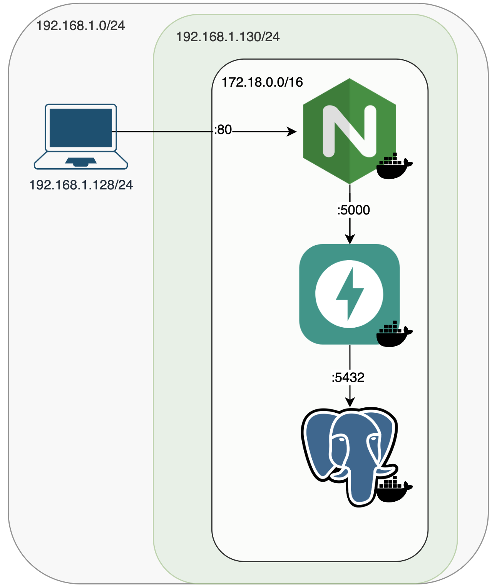

# Feature Hub Project

Featurehub is a microservices-based application that provides a platform to **propose features, discuss them through comments, and prioritise them using likes**.

It includes:

- REST API built with **FastAPI**
- **PostgreSQL** database with **Alembic** migrations
- User authentication based on **OAuth2** and **JWT**
- Static **HTML/JS/CSS** frontend
- **Nginx** reverse proxy to serve the app
- All services are fully **dockerised**
- Complete deployment via **Docker Compose**

---

## 🏗️ Architecture




### 🚀 Technology

- FastAPI + SQLModel  
- PostgreSQL  
- Alembic (migrations)  
- Argon2 (password hashing)  
- OAuth2 + JWT  
- Docker & Docker Compose  
- Nginx  

### Requirements

- **Docker**

##  🔧 Deployment

### 1. Clone the repository
```bash
git clone https://github.com/beatrizruiz98/Feature-Hub
cd Feature-Hub
```

### 2. Create the .env file

Create a .env file in the project root with the parameters expected by the application:

```env
database_hostname=hostname
database_port=5432
database_username=username
database_password=password
database_name=database_name
secret_key=secret_key
algorithm=algorithm
access_token_expire_minutes=minutes
```

### 3. Start the application

- Development 
```bash
docker compose -f docker-compose-dev.yml up --build
```
- Production
```bash
docker compose -f docker-compose-prod.yml up
```
*When updating images for production deployments, remember to tag and push them to Docker Hub.*

---

## 📁 Project Structure

```
backend/  
  app/
    main.py             # Configures FastAPI and CORS middleware
    routers/
      features.py       # CRUD for features and like queries
      comments.py       # Comment management for each feature
      likes.py          # Like/unlike actions (dir=1 or dir=0)
      auth.py           # Registration, login and user profile
    models.py           # SQLModel tables: Users, Features, Likes, Comments
    schemas.py          # Pydantic request/response models
    database.py         # SQLModel session and engine
    oauth2.py           # JWT helpers + get_current_user dependency
    utils.py            # Argon2 hashing/verification (pwdlib)
    config.py           # Loads environment variables via pydantic-settings
  alembic/
    env.py
    versions/           # Versioned migrations
  requirements.txt
  Dockerfile            # API image build instructions
nginx/ 
  /front                # HTML, JS, CSS
    index.html
    /static
      app.js
      styles.css
  featurehub.conf       # Nginx config for serving the app
  nginx.conf            # Global Nginx configuration  
docker-compose-dev.yml  # Dev deployment (build-based + hot reload)
docker-compose-prod.yml # Production deployment (image-based)
README.md
```

---

## 🧠 Tech Stack & Decisions

- **FastAPI + SQLModel:** CRUD, automatic validation, SQLAlchemy-compatible
- **PostgreSQL + Alembic:** relational persistence and reproducible migrations
- **OAuth2 + JWT:** authentication based on the `password grant`
- **Argon2/pwdlib:** strong password hashing
- **pydantic-settings:** centralised `.env` configuration
- **CORS middleware:** allows testing from predefined local hosts
- **Nginx:** serves the app and the API through a reverse proxy for high efficiency

---

## 📡 Main Endpoints

| Method | Path                | Description                                                   | Auth |
|:-----:|---------------------|---------------------------------------------------------------|:----:|
| **POST**   | `/auth/register`    | Register a new user                                    | ❌   |
| **POST**   | `/auth/login`       | Obtain JWT token (OAuth2PasswordRequestForm)               | ❌   |
| **GET**    | `/auth/me`          | Authenticated user profile                            | ✅   |
| **GET**    | `/features`         | List features (pagination, search, author filters)  | ✅   |
| **GET**    | `/features/{id}`    | Get feature summary with like count           | ✅   |
| **POST**   | `/features`         | Create own feature                                      | ✅   |
| **PUT**    | `/features/{id}`    | Update user’s feature                            | ✅   |
| **DELETE** | `/features/{id}`    | Update user’s feature                                   | ✅   |
| **GET** | `/features/{id}/comments`    | Get comments for a feature                                 | ✅   |
| **POST**   | `/likes`            | Add (dir=1) or remove (dir=0) a like| ✅   |
| **GET**    | `/comments/{id}`    | Retrieve a specific comment                              | ✅   |
| **POST**   | `/comments`         | Publish a comment associated with a feature                   | ✅   |
| **DELETE** | `/comments/{id}`    | Delete own comment                                   | ✅   |

All authenticated routes require:

```
Authorization: Bearer <access_token>
```
*PUT /features, DELETE /features and DELETE /comments are not available in the frontend.*

---

## 🛠️ Troubleshooting

| Issue | Likely Cause | Solution |
|-------|--------------|----------|
| Error connecting to DB | Incorrect `.env` variables or PostgreSQL down | Verify credentials and ensure the service is running |
| `401 Unauthorized` | Missing or expired token | Log in again and send `Authorization: Bearer <token>` |
| `404 Feature … was not found` | Invalid ID or deleted by another user | Make sure the resource exists before making the request |
| CORS blocked response | Origin not included in `origins` (app/main.py) | Add the host to the allowed origins |
| Networking issues between frontend & backend | Incorrect addresses in Nginx or API config | Inspect Docker networks using `docker network inspect <network>` and check traffic with `tshark` |


---

## 📜 License

**MIT © 2025 [Beatriz]**


